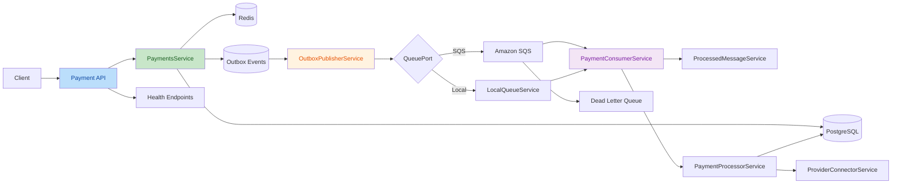
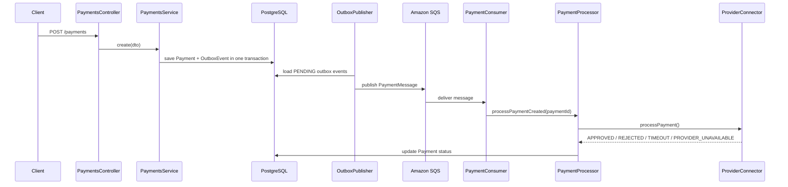

# Payment Platform

> A portfolio-grade, architecture-focused payment processing platform built with NestJS, PostgreSQL, Redis, and Amazon SQS patterns.

This repository is designed to showcase the transition from application development to software architecture thinking.
It demonstrates how to model a payment workflow using asynchronous processing, transactional consistency, idempotency, resilience patterns, and clean separation between HTTP, persistence, messaging, and background processing concerns.

## Executive Summary

Modern payment systems are not just CRUD APIs. They must protect against duplicate requests, preserve consistency between state changes and event publication, tolerate transient infrastructure failures, and support asynchronous processing at scale.

This project simulates that reality with a modular NestJS backend that implements:

- Transactional payment creation
- Request idempotency with Redis + PostgreSQL fallback
- Transactional Outbox Pattern
- Background publishing to SQS
- Consumer-side idempotency
- Dead Letter Queue inspection
- Circuit breaker behavior in the provider integration layer
- Operational health endpoints
- Automated unit tests with mocks for fast feedback

## Why This Project Matters

This codebase is intentionally structured to reflect architectural concerns that recruiters, hiring managers, and senior engineering leaders look for:

- **Reliability**: avoids losing events when persisting payments and publishing asynchronously
- **Scalability**: decouples API write operations from downstream processing
- **Resilience**: tolerates cache failures, duplicate deliveries, and provider instability
- **Separation of concerns**: isolates transport, orchestration, persistence, and domain flow
- **Cloud readiness**: supports Amazon SQS and DLQ-based operational troubleshooting

## Architecture At A Glance



## End-To-End Flow

The main business flow is intentionally asynchronous:

1. A client calls `POST /payments`.
2. The API checks idempotency in Redis and, if needed, in PostgreSQL.
3. The system creates the `Payment` and the `OutboxEvent` in the same database transaction.
4. A background publisher reads pending outbox records and publishes them to the selected queue implementation.
5. The consumer receives the message and verifies whether it was already processed.
6. The payment processor calls the provider connector and updates the payment status.
7. Failed message deliveries can be routed to a DLQ for operational inspection.



## Architectural Decisions

### 1. Modular Monolith With Clear Boundaries

The system is implemented as a modular monolith, not as microservices.
This is a deliberate decision: it keeps operational complexity low while still demonstrating clean boundaries and distributed systems patterns inside a single deployable codebase.

Current modules and responsibilities:

- `health`: liveness and readiness checks
- `payments`: business logic, persistence, messaging, worker flow, provider simulation
- `main.ts`: HTTP bootstrap
- `worker.ts`: background runtime bootstrap

### 2. Transactional Outbox Pattern

The most important consistency guarantee in the project is implemented through the outbox pattern.
When a payment is created, the system persists:

- the business record (`Payment`)
- the integration event (`OutboxEvent`)

in the same transaction.

This avoids the classic failure mode where the database commit succeeds but event publication fails, or vice versa.

### 3. Queue Port Abstraction

The project uses a queue abstraction through `QUEUE_PORT`, which allows the application to publish messages without binding the business flow directly to SQS.

This gives two runtime options:

- `SqsQueueService` for Amazon SQS
- `LocalQueueService` for local/direct in-process dispatch

This is a practical example of dependency inversion applied to infrastructure.

### 4. Dual-Layer Idempotency

Payment creation is protected by more than one safeguard:

- Redis lookup for fast deduplication
- PostgreSQL lookup by `idempotencyKey`
- unique constraint at the persistence layer

This reflects a common fintech design choice: treat cache as an optimization, not as the source of truth.

### 5. Consumer Idempotency

SQS standard queues provide at-least-once delivery semantics.
Because duplicates are possible, the consumer persists processed message IDs to avoid reprocessing.

This is implemented through:

- `ProcessedMessageService`
- the `processed_messages` table
- payment state validation before applying status transitions

### 6. Resilience With Circuit Breaker Behavior

The provider connector includes a lightweight circuit breaker model:

- failures are counted
- the circuit opens after repeated failures
- the provider fails fast while the circuit is open
- the connector transitions to half-open before recovery

This communicates an architectural mindset around fault isolation and graceful degradation.

## Patterns Implemented

| Pattern | Why It Is Used | Where It Appears |
| --- | --- | --- |
| Transactional Outbox | Preserve consistency between DB writes and event publication | `PaymentsService`, `OutboxPublisherService` |
| Idempotency | Prevent duplicate payment creation | `PaymentsService`, `IdempotencyCacheService`, DB unique key |
| Consumer Idempotency | Prevent duplicate message processing | `PaymentConsumerService`, `ProcessedMessageService` |
| Dependency Inversion | Decouple business flow from queue technology | `QUEUE_PORT`, `LocalQueueService`, `SqsQueueService` |
| Background Worker | Offload asynchronous processing from the API | `worker.ts`, `OutboxPublisherService`, `SqsConsumerService` |
| Circuit Breaker | Isolate unstable provider behavior | `ProviderConnectorService` |
| Graceful Degradation | Keep service operational when cache is unavailable | `IdempotencyCacheService` |
| Health Check Pattern | Expose liveness/readiness for orchestration | `HealthController`, `HealthService` |

## Technology Stack

### Core

- Node.js 20
- TypeScript
- NestJS 11
- TypeORM

### Data & Messaging

- PostgreSQL 16
- Redis 7
- Amazon SQS via AWS SDK v3

### Tooling

- Docker
- Docker Compose
- Jest
- ESLint
- Prettier

## API Surface

### Create Payment

```http
POST /payments
```

Request body:

```json
{
  "idempotencyKey": "payment-001",
  "customerId": "customer-123",
  "merchantId": "merchant-456",
  "qrData": "000201010212...",
  "amountInCents": 150050,
  "currency": "ARS"
}
```

### Get Payment Status

```http
GET /payments/:id
```

### Inspect Dead Letter Queue

```http
GET /payments/dlq
```

### Health Endpoints

```http
GET /health
GET /health/ready
```

## Payment State Model

| Status | Meaning |
| --- | --- |
| `PROCESSING` | Payment was accepted and is waiting for asynchronous processing |
| `PENDING` | Provider response was inconclusive, retry or manual investigation may be needed |
| `APPROVED` | Payment was successfully authorized/processed |
| `REJECTED` | Payment was rejected by business/provider rules |
| `FAILED` | A technical condition prevented successful processing |

## Project Structure

```text
src
├── health
│   ├── health.controller.ts
│   └── health.service.ts
├── payments
│   ├── dto/
│   ├── dlq-inspector.service.ts
│   ├── idempotency-cache.service.ts
│   ├── local-queue.service.ts
│   ├── outbox-event.entity.ts
│   ├── outbox-publisher.service.ts
│   ├── payment-consumer.service.ts
│   ├── payment-message.interface.ts
│   ├── payment-processor.service.ts
│   ├── payment.entity.ts
│   ├── payments.controller.ts
│   ├── payments.module.ts
│   ├── payments.service.ts
│   ├── processed-message.entity.ts
│   ├── processed-message.service.ts
│   ├── provider-connector.service.ts
│   ├── queue-bootstrap.service.ts
│   ├── queue.constants.ts
│   ├── queue.interface.ts
│   ├── sqs-consumer.services.ts
│   └── sqs-queue.service.ts
├── app.module.ts
├── main.ts
└── worker.ts
```

## Runtime Modes

The repository separates HTTP traffic from background processing.

Current scripts:

| Script | Purpose |
| --- | --- |
| `npm run start:api` | Runs the HTTP API with publisher and consumer disabled |
| `npm run start:publisher` | Runs the worker entrypoint with outbox publishing enabled and consumer enabled |
| `npm run start:consumer` | Runs the worker entrypoint with consumer enabled and outbox publishing disabled |

## Local Setup

### 1. Install dependencies

```bash
npm install
```

### 2. Start infrastructure

```bash
docker compose up -d postgres redis
```

### 3. Start the API

```bash
npm run start:api
```

### 4. Start background processing

Worker with publishing enabled:

```bash
npm run start:publisher
```

Consumer-focused worker mode:

```bash
npm run start:consumer
```

### 5. Full Docker environment

```bash
docker compose up --build
```

## Deployment And Infrastructure Notes

The project is intentionally dockerized to communicate deployment readiness and environment isolation.

The current `docker-compose.yml` provisions:

- PostgreSQL
- Redis
- API container
- Worker container

The application is prepared to run with Amazon SQS and AWS credentials mounted into the container environment.

## Testing Strategy

The repository emphasizes fast and isolated unit tests:

- Jest-based unit tests
- mocks for infrastructure dependencies
- no heavy external dependencies required for core validation
- coverage focused on business flow and integration boundaries

Useful commands:

```bash
npm test -- --runInBand
npm run test:cov -- --runInBand
```

## What This Demonstrates As A Project

This project is not meant to be a toy CRUD app.
It is meant to demonstrate how an engineer thinks about architecture.

It highlights the ability to:

- design reliable asynchronous workflows
- identify and mitigate consistency risks
- model failure modes explicitly
- separate concerns across runtime components
- introduce infrastructure abstractions cleanly
- communicate system design with production-oriented language

For recruiters and engineering leaders, this repository signals readiness for conversations around:

- backend platform design
- event-driven systems
- integration architecture
- cloud-native service design
- reliability patterns in fintech-like domains

## Suggested Next Evolution

If this project continued toward production hardening, the natural next steps would be:

- Terraform or AWS CDK for infrastructure provisioning
- ECS/Fargate or Kubernetes deployment
- OpenTelemetry traces and metrics
- Prometheus/Grafana dashboards
- structured audit logging
- secret management with AWS Secrets Manager
- database migrations instead of `synchronize`
- retry policies and DLQ replay tooling

## Final Note

This repository was built to tell a story:
from writing backend features to designing reliable systems.

If you are evaluating this project as part of an architecture-oriented portfolio, the key value is not only that payments can be created, but that the system shows intentional design around consistency, messaging, resilience, and operational thinking.
